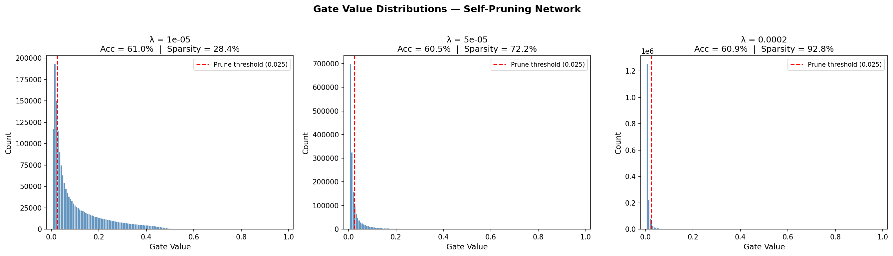
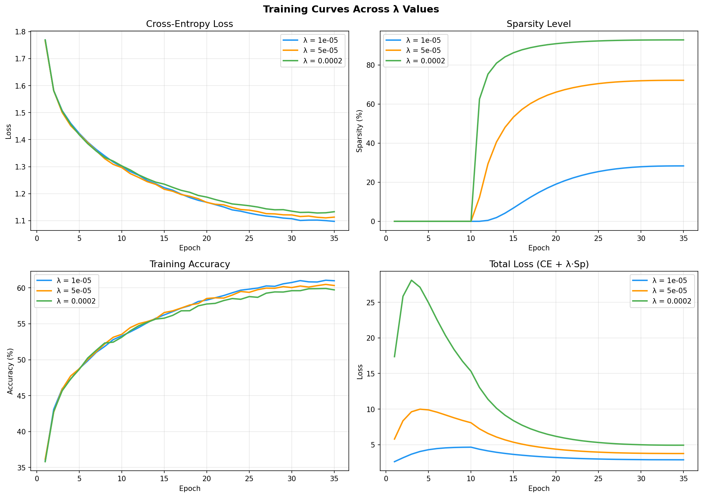

# The Self-Pruning Neural Network

A neural network that learns to prune itself during training on CIFAR-10,
using learnable gate parameters and L1 sparsity regularisation.

---

## Why L1 Penalty on Sigmoid Gates Encourages Sparsity

Each weight is paired with a gate value `g = σ(gate_score)` ∈ (0, 1). The
**SparsityLoss** is the L1 norm (sum) of all gate values across all layers.
Adding `λ × SparsityLoss` to the classification loss creates two competing forces
on every gate:

- **Classification gradient** — pushes important gates *up* (keeps them active).
- **L1 gradient** — pushes *all* gates *down* toward zero.

The L1 penalty's gradient has **constant sign**, so even very small gates continue
to receive a downward push. Unlike L2 (whose gradient vanishes near zero), L1
drives values all the way to zero. Only gates whose classification gradient is
strong enough to resist the L1 push survive — these correspond to the truly
important weights. The result is a **bimodal distribution**: a spike near 0
(pruned) and a cluster away from 0 (retained).

λ controls the threshold of importance: higher λ demands stronger justification
for a weight to survive, producing more aggressive pruning at the cost of accuracy.

---

## Results

| Lambda (λ) | Test Accuracy (%) | Sparsity Level (%) |
|:----------:|:-----------------:|:------------------:|
| `1e-05`    | 61.03             | 28.36              |
| `5e-05`    | 60.49             | 72.16              |
| `2e-04`    | 60.90             | 92.81              |

As λ increases, the network prunes more aggressively — from 28% to 93% of all
connections removed — while maintaining test accuracy around 60%. This demonstrates
the sparsity-vs-accuracy trade-off: even at 92.8% sparsity (only ~7% of weights
active), the network retains nearly the same accuracy as the lightly-pruned variant.

---

## Gate Value Distribution



---

## Training Curves



---

## How to Run

```bash
pip install torch torchvision matplotlib numpy
python model.py
```
